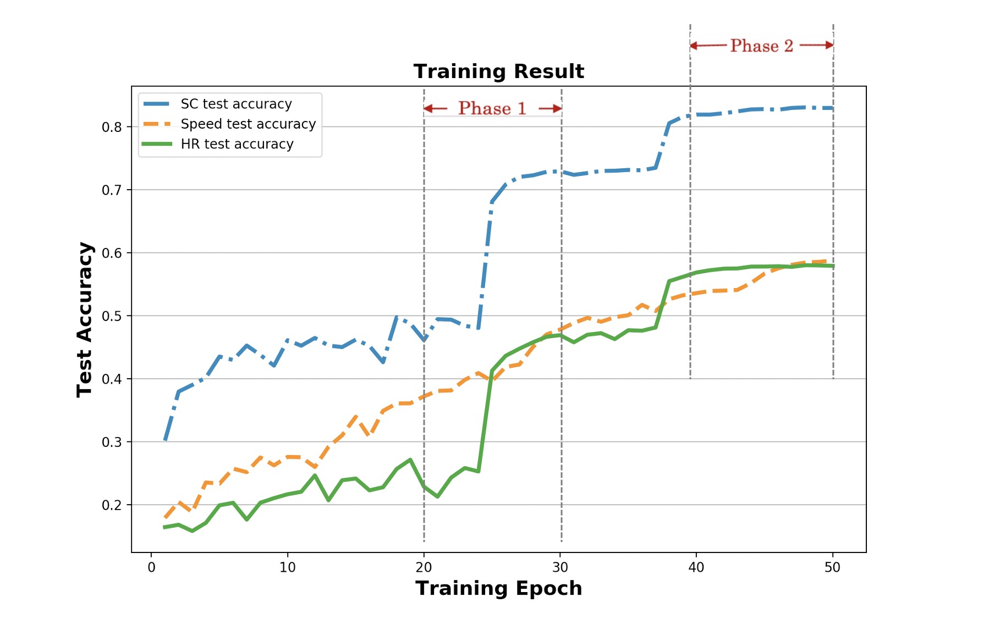

# It is a collection of some important figures in the whole project.

1.  
This figure shows the predicted results(Skin conductance, heart rate and vehicle speed) after being processed by our models.

2.  
This figure illustrates three trained models' accuracy, which for estimating heart rate, skin conductance and vehicle speed are *83.78%*, *59.89%*, and *58.60%* respectively.
